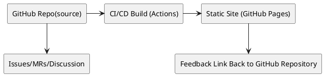
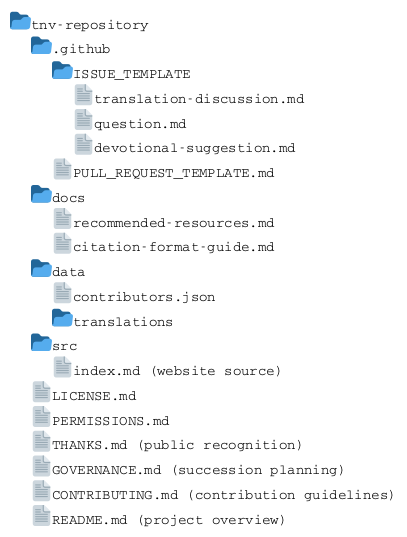
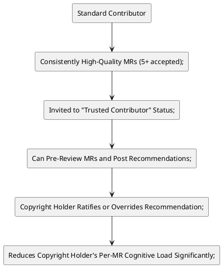
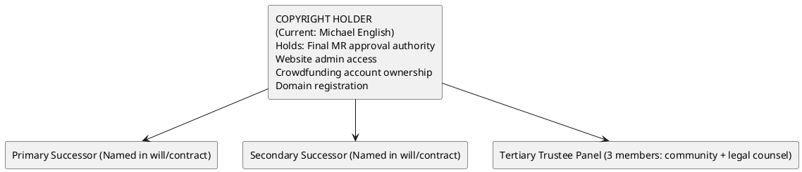
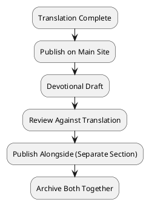

Transparent Nuance Version Business Plan
=========================================
**A Community-Powered Bible Translation Project**

**Document Status:** Planning Phase (Version 1.0)

**Creation Date:** July 18, 2026

**Last Updated:** July 26, 2026

**Location:** docs/planning/business-plan.md

---

# Executive Summary
The Transparent Nuance Version (TNV) is a community-powered Bible translation project focused on preserving textual nuance and maintaining complete transparency in the translation process. The copyright holder retains final editorial authority while offering public feedback through an open development model.
TNV's posture: come and see what the original text reveals—you belong in this conversation.

**Key Differentiators**
| Traditional Bible Translations | TNV Approach |
|--------------------------------|--------------|
| Closed committee process | Open Merge Request workflow |
| Final product only | Translation process visible in real-time |
| Single authoritative voice | Community feedback documented and transparent |
| Published result only | Footnotes show decision rationale and sources |
| Fixed after publication | Continuous improvement with editorial oversight |

TNV launches with minimal cost infrastructure (zero-cost GitHub ecosystem) and transitions to long-term growth and sustainability through community crowdfunding. Editorial sustainability is the critical design constraint—every structural decision prioritizes the copyright holder's ability to continue long-term without burnout.

# Mission Statement

TNV exists not merely as an academic exercise but as an invitation to encounter the text—and its Author—in a richer way. Every verse rendered, every nuance preserved, every Merge Request reviewed is in service of helping people personally connect with the God who inspired the text.

# Core Values
| Value | Operational Implication |
|-------|-------------------------|
| Encouragement | Every interaction with the project should draw people deeper into Scripture and closer to the God who inspired it. TNV exists not merely as an academic exercise but as an invitation to encounter the text—and its Author—in a richer way. |
| Transparency | Show source text, alternatives, decision rationale, and footnote documentation for every choice. All translation decisions are traceable to their reasoning. |
| Academic Rigor | All translation decisions must be documented through citations to reliable, publicly accessible resources (Strong's, BDB, Thayer's, Alfred grammars, peer-reviewed journals). |
| Stewardship | Maintain editorial control under license; protect intellectual integrity; ensure project longevity through pacing architecture and delegation pathways. Editorial authority is inseparable from copyright ownership, and succession must preserve this relationship. |
| Sustainability | Build systems that prevent editorial burnout AND ensure institutional continuity beyond the founding copyright holder. Succession planning is required: identify successors, document transfer mechanisms, test the handover process, and maintain redundancy in decision authority. The project must survive the copyright holder. |
| Gratitude | Every contributor receives explicit, public acknowledgment. TNV maintains a running, searchable list of all who have participated—from Merge Requests to crowdfunding—with appropriate respect for privacy preferences. Recognition honors both the contribution and the person's investment in Scripture. |

## What Encouragement Looks Like in Practice

This value shapes engagement as much as structure:

| Context | Implementation |
|---------|----------------|
| Issue/MR Templates | Invite contributors to share why a particular nuance matters spiritually, alongside technical justification |
| Translation Notes | Occasionally include brief devotional observation—window into how nuance illuminated translator's own faith journey |
| Community Posture | "Come and see what the original text reveals—you belong in this conversation" |
| Discussion Channels | GitHub Discussions tab open for extended theological dialogue, separate from formal translation changes |

## What Transparency Looks Like in Practice
| Context | Implementation |
|---------|----------------|
| Free public access | Publish to freely accessible read-only site.  Public collaboration through separate site with free membership creation. |
|Decision Rationale | Translator's Notes document reasoning for complex passages |
| Clear Contribution Rules | Contribution policy is clearly posted to user upon sign-up and on visible area of contribution site. |
| Rejected MRs | Preserved in repository history with closing comments |
| Succession Record | /GOVERNANCE.md publicly lists current copyright holder, designated successors, trigger conditions, and transfer procedures |
| Trustee Information | Names and contact methods for successor holders (with privacy controls if necessary) |

## What Academic Rigor Looks Like in Practice

This value ensures credibility across all channels:

| Context | Implementation |
|---------|----------------|
| Issue Templates | Members may submit complaints, text corrections, and/or updates to the approved resource lists through a template-driven GitHub Issue, which has separate required fields for claim, argument, and evidence. When content is challenged, appropriate citations are mandatory, even in discussions.  A submitted Issue may be rejected if evidence from an approved source is not provided for a claim or discussion. |
| Merge Request Template | Members may submit changes to existing documents (or introduce new documents) via a template-driven Merge Request. The changes will be reviewed for adherence to submittal policy .  A submitted Merge Request may be rejected if evidence from an approved resource is not provided for all disputable translation decisions. |
| Approved Resources List | /docs/recommended-resources.md with approved resources only |
| Footnotes | Each verse displays source citations; Translator's Notes document decision rationale for complex passages |

## What Stewardship Looks Like in Practice

This value encompasses the copyright holder's role AND the copyright structure:

| Context | Implementation |
|---------|----------------|
| Copyright Ownership | Founder holds initial copyright; estate plan specifies successor or trustee |
| Editorial Authority | Sole approver for all MRs; transfer conditions defined in advance |
| License Terms | CC BY-NC-ND 4.0 remains fixed; successor cannot alter without community notice |
| Succession Document | /GOVERNANCE.md defines who inherits control, under what conditions, and with what limitations |
| Community Notification | Succession triggered events announced publicly with timeline for transition |

## What Sustainability Looks Like in Practice

This value now operates on two levels—individual and institutional:

| Individual Sustainability | Institutional Sustainability |
|---------------------------|------------------------------|
| Pacing architecture (hard caps, batched reviews, quarterly sabbaticals) | Succession planning (designated successors, transfer protocols, documentation) |
| Cognitive load management (never translate and review same day) | Copyright holder redundancy (trusteeship, legal structures for transfer) |
| Emotional weight mitigation (template language, peer support) | Community awareness of succession plan (publicly documented, not secret) |
| Delegation pathway (trusted contributors, research assistants) | Decision authority distribution (emergency protocols if copyright holder incapacitated) |

Both levels must function simultaneously. Individual sustainability without succession leads to an eventual collapse when copyright holder leaves.  Succession without individual sustainability leads to premature transition before institution is ready.

## What Gratitude Looks Like in Practice

This value shapes both structure and tone:

| Context | Implementation |
|---------|----------------|
| Merge Request Acceptance | "Thank you for this thoughtful submission, [@contributor]! Your research into [lexicon/grammar reference] strengthened the translation in this verse." |
| Merge Request Decline | "Thank you for investing time in studying this passage, [@contributor]. I've learned from your research on [specific point]. While this particular rendering won't be adopted for [reason], your engagement deepens the conversation around this text." |
| Merge Request Revision | "Thanks for submitting this proposal, [@contributor]! Your insight about [observation] is valuable. Would you be willing to look up [term] in [resource]?" |
| THANKS.md File | Prominent listing with privacy options; updated monthly; searchable by contributor name |
| Crowdfunding Recognition | Tiered acknowledgment benefits; anonymous option available; gratitude ritualized monthly via newsletter |
| Annual Reports | Year-end gratitude statement with cumulative stats and contributor highlights |

## Interrelationships Between Values
| Value Pair | Synergy | Potential Tension |
|------------|---------|-------------------|
| Gratitude + Academic Rigor | Recognition for high-quality contributions incentivizes rigorous engagement | Rejecting poorly-substantiated proposals still requires gratitude—thank them for effort while requiring revision |
| Encouragement + Transparency | Visible deliberation invites deeper learning | Full transparency of rejected MRs may discourage timid contributors—mitigate with warm rejection language |
| Stewardship + Sustainability | Editorial control preserves quality; pacing preserves capacity | Too much stewardship (rigidity) can alienate community; too much sustainability (transparency) can enable burnout |
| Transparency + Academic Rigor | Anyone can contribute if they do the work | Free transparency attracts drive-by suggestions—template requirements filter without gatekeeping |

## Foundational Principle

> The project's survival depends on the copyright holder's wellbeing. Every structural decision—including the decision to grow, add features, or accept more contributions—must be weighed against its impact on editorial sustainability. A smaller, slower, long-lived project serves the text better than a larger, faster, abandoned one.

This principle sits beneath all six values, particularly guiding the tension between Encouragement/Sustainability and Stewardship/Transparency.

# Technical Architecture

## Phase 1: Zero-Cost Foundation



### Technology Stack:
* **Source Control:** GitHub (free tier)
* **Building:** GitHub Actions (free for public repos, limited minutes)
* **Hosting:** GitHub Pages (free) or Cloudflare Pages (free tier)
* **Storage Format:** Markdown or JSON with embedded annotations
* **Feedback Channel:** GitHub Issues (structured), Discussions (unstructured), Merge Requests (translation changes)

### Portability Considerations

To protect against platform dependency issues:

* Keep all content in plain text formats (no proprietary database locks)
* Document CI/CD configuration as scripts that could run locally
* Maintain asset directory structure compatible with Jekyll/Hugo/MkDocs
* Export regular backups to cloud storage or local drive
* Register domain name independent of hosting provider
* Test migration procedures annually

### Directory Structure

### Repository File Guide

Each file in the repository serves a specific purpose within the project. 
The following table maps each file to where it is explained in this business plan.

| File | Purpose | Detailed In Section |
|------|---------|---------------------|
| `README.md` | Project overview; first thing visitors see on GitHub | [Technical Architecture](#technical-architecture) |
| `LICENSE.md` | Full CC BY-NC-ND 4.0 license text + pointer to PERMISSIONS.md | [Licensing Strategy](#licensing-strategy) |
| `PERMISSIONS.md` | Blanket quotation permission, footnote guidance, commercial use carve-out | [Licensing Strategy](#licensing-strategy) |
| `CONTRIBUTING.md` | Merge Request workflow, citation requirements, review cadence expectations, copyright grant | [Resource Requirements](#resource-requirements--citation-standards) & [Licensing Strategy](#licensing-strategy) |
| `THANKS.md` | Public contributor recognition with privacy controls | [Gratitude Infrastructure](#gratitude-infrastructure) |
| `GOVERNANCE.md` | Copyright succession, transfer procedures, successor limitations | [Succession Planning](#succession-planning) |
| `.github/PULL_REQUEST_TEMPLATE.md` | MR template with citation fields and privacy checkbox | [Community Engagement Model](#community-engagement-model) |
| `.github/ISSUE_TEMPLATE/translation-discussion.md` | Guided discussion format requiring claim, argument, and evidence | [Issue Templates](#issue-templates) |
| `.github/ISSUE_TEMPLATE/question.md` | Guided question format for clarifications | [Issue Templates](#issue-templates) |
| `.github/ISSUE_TEMPLATE/devotional-suggestion.md` | Devotional proposal template linking to translation footnotes | [Issue Templates](#issue-templates) |
| `docs/recommended-resources.md` | Approved academic resources list with accessibility notes | [Resource Requirements](#resource-requirements--citation-standards) |
| `docs/citation-format-guide.md` | Citation format examples for each resource type | [Resource Requirements](#resource-requirements--citation-standards) |
| `data/contributors.json` | Machine-readable contributor tracking for THANKS.md automation | [Gratitude Infrastructure](#gratitude-infrastructure) |
| `data/translations/` | Translation source files in Markdown or JSON | [Technical Architecture](#technical-architecture) |
| `src/index.md` | Static site source for published website | [Technical Architecture](#technical-architecture) |

## Phase 2: Migration Path (if needed)
| Platform | Cost Tier | Notes |
|----------|-----------|-------|
| GitHub → GitLab | Free | Similar feature parity |
| GitHub Pages → Netlify/Vercel | Free tier sufficient initially | Better caching, form support
| Self-hosted VPS | $5-20/mo | Full control, added complexity |

### Migration Checklist
* All content in version control (not just rendered site)
* CI/CD configuration documented and scriptable
* Domain registration independent of hosting provider
* Database export/import procedures tested
* Email notification system redundancy planned
* Annual migration dry-run performed
* Succession documentation validated during migration

# Community Engagement Model
## Contribution Flow: Merge Request Centric
```plantuml
:Contributor Forks Repo;
:Creates Branch with Proposed Change;
:Creates Merge Request;
repeat
  :Submits Changes;
  :Reviewers Provide Feedback;
repeat while (continue discussion?) is (yes) not (no)
if (acceptable MR?) then (yes)
  :Copyright Holder Approves MR;
else (no)
  :Copyright Holder Declines MR;
endif
:Merge Request History Preserved (Part of the Permanent Transparent Record);

```

**All public text contributions flow through Merge Requests.** No text change reaches the published translation—or the live site—without explicit copyright holder approval.

## How This Differs from Other Models
| Aspect | Typical "Open" Projects | TNV Approach |
|--------|-------------------------|--------------|
| Contribution mechanism | Issues, PRs, wiki edits | Merge Requests only |
| Approval authority | Multiple maintainers | Copyright holder exclusively |
| Unstructured discussion | Mailing lists, forums | Kept within MR comment threads |
| Scope creep | Contributors add features freely | All changes scoped to translation/explanation |
| Community building | Often incidental | Intentional Encouragement + Gratitude focus |

## Structuring Merge Request Templates

GitHub supports .github/PULL_REQUEST_TEMPLATE.md:

```
<!-- .github/PULL_REQUEST_TEMPLATE.md -->

## Translation Change Proposed

**Verse(s) affected:** 
(e.g., John 1:1)

**Current TNV rendering:**
> [quote current TNV text]

**Proposed rendering:**
> [quote proposed new text]

---

## Linguistic Justification

### Source Text Analysis
[Brief description of the original language text—word forms, grammatical structures, 
etc. Include Strong's numbers if applicable.]

### Lexical Evidence
[Which lexicon entries support your proposed rendering? Provide exact citations 
from resources in the Approved Resources list (/docs/recommended-resources.md).]

**Example:**
> According to Strong's G5667, ὄνομα (onoma) carries connotations of...
> BDB 5478 indicates that the Hebrew term can mean either...

### Grammatical Basis
[Reference grammar rules that inform your understanding from resources in the 
Approved Resources list.]

**Example:**
> Following Alfred's *Simplified Hebrew Grammar*, p. 42, the yiqtol form in this 
> context suggests... (see also "The Panchronic Yiqtol" paper, section 3.2)

- [ ] All citations are from the Approved Resources list in /docs/recommended-resources.md
- [ ] I have referenced specific entry numbers, pages, or sections for all citations
- [ ] All cited resources are freely accessible online (no paywalls, no purchase required, no library access needed)

---

## Nuance Observed

[What meaning or emphasis does your rendering capture that the current one misses?
Why does this nuance matter for accurate comprehension?]

---

## Personal Reflection (Optional but Encouraged)

[What did you discover in this passage that deepened your connection with God? 
The TNV exists not just to translate words but to invite people into Scripture. 
We'd love to hear how this passage spoke to you.]

---

## Privacy Preference

- [ ] I consent to public acknowledgment in THANKS.md (full name)
- [ ] Please use my display name only
- [ ] Please keep my contribution anonymous but recorded

---

## Copyright Acknowledgment

By submitting this Merge Request, I agree to the contribution terms in CONTRIBUTING.md, including:

- [ ] I have read and agree that upon merge, my contribution becomes part of the TNV translation 
      and is licensed under the same CC BY-NC-ND 4.0 terms as the rest of the work
- [ ] I understand that the copyright holder retains final editorial authority and the right 
      to grant commercial licenses for the complete work
- [ ] I understand that accepted contributions will be acknowledged in THANKS.md per my privacy preference
- [ ] I confirm that my contribution is my own original work and does not infringe on the rights of others

---

## Self-Check

- [ ] My proposal preserves nuance rather than smoothing it away
- [ ] My tone is respectful and collaborative
- [ ] I have checked whether my proposed change creates conflicts elsewhere in the translation
- [ ] I understand that this Merge Request may be accepted, declined, or returned for revision
```

## Feedback for Non-Translation Input
| Contribution Type | Vehicle | Requires MR? |
|-------------------|---------|--------------|
| Translation correction or alternative | Merge Request | Yes |
| Typo or formatting fix | Merge Request | Yes (lightweight) |
| General question or discussion | GitHub Discussions or Issue with "Question" label | No |
| Devotional suggestion | Issue with "Devotional" label | No (discussed separately) |
| Feature request for the site | Issue with "Feature" label | No |

# Maintaining Editorial Authority While Building Community
Copyright holder controls:

* Which Merge Requests are accepted
* The final wording of every verse
* The project's theological posture and framing
* What appears on the published site

Public is invited to:

* Public scrutiny of translation choices
* Alternative renderings with supporting evidence
* Discussion of why nuances matter
* Community formation around shared engagement with Scripture

The MR requirement means that even rejected contributions remain visible in the repository history. This transparency serves Encouragement too—seeing why a suggestion was declined teaches the community about the translation process and deepens their understanding of the text.

## Guardrails for Review Burden
| Strategy | Implementation |
|----------|----------------|
| MR volume limits | State in CONTRIBUTING.md: "I aim to review MRs within 2 weeks. If volume exceeds my capacity, reviews may take longer." |
| Quality bar upfront | Template requires lexicon consultation; this filters out drive-by suggestions |
| Batch review sessions | Set aside one block per week (e.g., Saturday morning) for MR review, rather than checking continuously |
| Closure without merge | It's acceptable to close an MR with thanks and explanation—merge is not guaranteed |
| Encourage resubmission | If an MR has promise but needs work, leave it open with constructive feedback rather than closing abruptly |

## Preventing Hostile Forks Under Your License
With CC BY-NC-ND on the translation text:

* Forking is allowed (that's how MRs work)
* Publishing modified versions is not allowed (ND clause)
* Commercial use is not allowed (NC clause)
* Attribution is required (BY clause)

If someone forks the repo and republishes altered translations elsewhere, your license terms give you grounds to request takedown.

# Issue Templates
## Translation Discussion Template
```
<!-- .github/ISSUE_TEMPLATE/translation-discussion.md -->

---
name: Translation Discussion
about: Propose a discussion about how a verse is rendered or understood (without specific text changes)
title: '[Discussion] Book Chapter:Verse — Brief Topic'
labels: ['translation', 'discussion']
---

## Passage Under Discussion

**Book & Chapter:** 
**Verse(s):** 
**Current TNV Rendering:** 
> [Quote current TNV text]

---

## Claim

[State plainly what you believe the verse is saying and/or meaning. Be specific: 
Are you addressing the denotation of a particular word? The syntactic structure? 
The semantic range? The theological implication of a rendering choice?]

---

## Argument

[Present your reasoning. Walk through the text and explain how you arrive at 
your claim. Address the current TNV rendering directly—where does it fall short, 
and what does it miss or obscure?]

---

## Supporting Evidence

[Cite at least one resource from the Approved Resources list in 
/docs/recommended-resources.md. Include specific references—entry numbers, 
page numbers, section identifiers. Quotations should be brief and directly relevant.]

**Example:**
> Strong's H7225 (reshith): "first, beginning, best, chief." The term carries 
> temporal priority but also the sense of preeminence, per BDB p. 912.
> Alfred, *Simplified Hebrew Grammar* §34: the construct form here indicates 
> relationship to what follows, not an independent temporal clause.

- [ ] I have cited at least one resource from the Approved Resources list
- [ ] I have referenced specific entries, pages, or sections
- [ ] All cited resources are freely accessible online (no paywalls, no purchase required, no library access needed)
- [ ] I have addressed the current TNV rendering specifically

---

## Open Questions

[What aspects of this passage remain genuinely uncertain to you? Where do you 
see legitimate scholarly disagreement? Acknowledging ambiguity strengthens 
your argument rather than weakening it.]

---

## Personal Reflection (Optional but Encouraged)

[What did you discover in this passage that deepened your connection with God? 
The TNV exists not just to translate words but to invite people into Scripture. 
We'd love to hear how this passage spoke to you.]

---

**Note:** This Issue is for discussion only. If you have a specific alternative 
rendering to propose as text, please submit a Merge Request instead. This template 
exists to explore the text before proposing changes.
```

## Triage Decision Matrix
| Contribution Type | Meets Footnote Requirement | Action |
|-------------------|----------------------------|--------|
| Strong lexical argument with proper citations | ✅ | Approve, decline, or discuss based on substance |
| Good intuition but no citation | ❌ | Return for revision with guidance on which resources to consult |
| Citation provided but to unreliable source | ❌ | Return for revision with resource list recommendations |
| Purely theological preference without linguistic basis | ❌ | Close with explanation; redirect to Devotional section |

# Licensing Strategy
## Recommended License Structure
| Component | License Type | Rationale |
|-----------|--------------|-----------|
| Translation Text | CC BY-NC-ND 4.0 | Attribution required, no derivatives, no commercial |
| Contributor Submissions | CC BY-NC-ND 4.0 | Implicit non-exclusive grant per CONTRIBUTING.md |
| Annotations/Footnotes | CC BY-NC-ND 4.0 | Unified with translation text for clarity and enforceability |
| Devotional Content | CC BY-NC-ND 4.0 | Same license as translation—simplifies framework, enables sharing |
| Website Code | All Rights Reserved | Infrastructure, not a project deliverable |

## License content

### LICENSE.md content

The content for LICENSE.md can be downloaded directly from the online CC-BY-NC-ND license: https://creativecommons.org/licenses/by-nc-nd/4.0/

### PERMISSIONS.md content

```
# TNV Permissions

The TNV translation is licensed under CC BY-NC-ND 4.0, with the following
additional permission granted by the copyright holder:

## Quotation in Commercial Works

Quotation of TNV text within a larger work is permitted, including in
commercially published works such as books, articles, courses, software,
and media productions, provided that:

1. Proper attribution is given ("TNV" + link to [project website])
2. The TNV text is quoted as part of a larger work, not repackaged as
   a standalone product
3. No complete Bible book or substantial portion of the TNV is
   reproduced as a sellable unit
4. No modified or derivative translation is created

## What Remains Prohibited

The following uses remain prohibited without express written permission
from the copyright holder:

- Publishing the complete TNV Bible as a standalone product
- Publishing any complete TNV Bible book as a standalone product
- Repackaging TNV text (alone or substantially) as a sellable unit
- Creating modified or derivative translations

## Footnote Markers

When quoting TNV text containing footnote markers:

- Include the corresponding footnote text alongside the quotation, OR
- Remove footnote markers cleanly without indicating their absence, OR
- Note the presence of omitted footnotes (e.g., "[footnote omitted]")

## Contact

For uses beyond these guidelines: [contact@tnv-project.example.com]
```
## Enforcement Mechanisms
* **Technical:** Clear copyright notices on every page; no bulk download buttons
* **Legal:** Terms of Service that reiterate license terms; DMCA takedown readiness
* **Community:** Public recognition of proper attribution; gentle correction of misuses
* **Important Note:** Creative Commons licenses are legally enforceable but rely heavily on community vigilance. Plan for periodic audits of where translations appear online.

## Succession Continuity
When transferring copyright to a successor, the CC license terms remain binding. The successor inherits both ownership and obligations:

* Cannot retroactively license previously-published translations differently
* Must maintain existing attribution records (THANKS.md)
* Can add future content under new terms only with clear community notice
* Must document transfer in /GOVERNANCE.md with public announcement

# Resource Requirements & Citation Standards

## Approved Resource List

All footnote citations must reference resources that are freely accessible 
online. Citations to paywalled, library-only, or purchase-required resources 
are not permitted.

| Resource | Language | Accessibility | Typical Use |
|----------|----------|---------------|-------------|
| **Strong's Exhaustive Concordance** | Hebrew/Greek | Free online (public domain) | Word-level concordance lookup |
| **Brown-Driver-Briggs (BDB) Hebrew Lexicon** | Hebrew | Free online (public domain) | Standard Hebrew word definitions |
| **Thayer's Greek Lexicon** | Greek | Free online (public domain) | Standard Greek word definitions |
| **Justin T. Alfred's Simplified Greek Grammar** | Greek | Free online | Grammatical structures, syntax |
| **Justin T. Alfred's Simplified Hebrew Grammar** | Hebrew | Free online | Grammatical structures, syntax |
| **"The Panchronic Yiqtol"** (JHS ISSN 1203-1542) | Hebrew | Free online (open-access journal) | Specific verb aspect analysis |

Additional free online resources may be added to this list by the copyright 
holder at any time. Contributions citing resources not on this list will be 
returned for revision.

## Footnote Display Format
Each verse on the published site displays:

```
John 1:1 (TNV)

"In the beginning was the Word, and the Word was with God, and the Word was God."

Footnotes:
- Ἐν ἀρχῇ (En archē): See Strong's G746; BDB 798; Thayer's G746 for temporal vs. logical "beginning"
- λόγος (logos): See Thayer's G3056; Strong's G3056 for philosophical and Jewish wisdom tradition background
- ἦν (ēn): Imperfect indicative of εἰμί (G1510); see Alfred Simplified Greek Grammar §45 for continuous aspect
```

## Suggested Language for CONTRIBUTING.md:

```
## Copyright & Contributions

By submitting a Merge Request to the TNV repository, you agree that:

1. Your contribution is offered freely for inclusion in the TNV project
2. Upon merge, your contribution becomes part of the TNV translation 
   and is licensed under the same CC BY-NC-ND 4.0 terms as the rest 
   of the work
3. The copyright holder retains the right to grant additional permissions
   and commercial licenses for the complete work
4. Your contribution—whether accepted or declined—will remain visible 
   in the repository history as part of the transparent record
5. Accepted contributions will be permanently acknowledged in THANKS.md 
   per your privacy preferences
6. You retain no ownership claim over merged text, but you may reuse 
   your own research and reasoning elsewhere
7. Your contribution is your own original work and does not infringe 
   on the rights of others
   
## Citation Policy

All footnote citations must reference resources that are freely accessible 
online. Citations to paywalled, library-only, or purchase-required resources 
are not permitted.

Approved resources are listed in /docs/recommended-resources.md.
```

# Funding & Sustainability Roadmap
## Zero-Cost Launch (Months 1-6)
| Item | Cost | Notes |
|------|------|-------|
| GitHub account | $0 | Public repo, basic Actions minutes |
| Hosting | $0 | GitHub Pages or equivalent |
| Domain name? | $0 (optional) | Can use github.io subdomain initially |
| Communication | $0 | GitHub Discussions, email |

Monthly Time Commitment Target: 3-4 hours

## Crowdfunding Phase (Months 6-18)
Recommended Approach: Start with Patreon

| Tier | Monthly Gift | Recognition Benefit |
|------|--------------|---------------------|
| Supporter | $3 | Name listed in THANKS.md (with privacy preference respected) |
| Scholar | $10 | Above + featured in monthly newsletter mention |
| Patron | $25 | Above + quarterly video shoutout during review session |
| Steward | $100 | Above + annual personal thank-you message + input on project priorities |

**Revenue Projection Scenarios**:

* 50 patrons at $10 = $500/month
* 20 supporters at $25 = $500/month
* Total = ~$1,000/month (enough for partial time dedication)

## Financial Allocation Framework
| Category | Percentage | Purpose |
|----------|------------|---------|
| Translation Time | 40% | Dedicated hours for core work |
| Infrastructure | 15% | Hosting, domain, tools as growth demands |
| Devotional Production | 25% | Writing, recording, video editing |
| Emergency Reserve | 20% | Buffer for unexpected expenses or slowdowns |

## Revenue Thresholds and Their Impact
| Monthly Revenue | What It Enables | Editorial Burden Impact |
|-----------------|-----------------|-------------------------|
| $0 | Hobby pace only; 3-4 hrs/week | Manageable short-term; risky long-term |
| $300-500 | Reduce day-job hours slightly; purchase resources | Moderate relief; cognitive load unchanged |
| $800-1,200 | Significant time reduction; 10-15 hrs/week possible | Substantial relief; review burden still solo |
| $1,500-2,000 | Near part-time dedication; hire research assistant | Major relief; delegation begins |
| $2,500+ | Full-time possible; contractor for formatting/moderation | Transformative; burnout risk drops dramatically |

# Burnout Prevention Framework
Editorial burnout is the existential threat. If the copyright holder burns out, the project stops entirely. Every structural decision must be evaluated against this question: "Does this increase or decrease the likelihood of editorial burnout?"

## The Five Burnout Vectors
| Vector | Description | How It Manifests |
|--------|-------------|------------------|
| Volume Load | Sheer quantity of MRs to review | Backlog grows; turnaround slows; guilt accumulates |
| Decision Fatigue | Every MR requires judgment between defensible alternatives | Trivial decisions become paralyzing; confidence erodes |
| Emotional Weight | Translating Scripture carries spiritual gravity; saying "no" to sincere contributions feels rejecting | Hesitation to review at all; avoidance behaviors |
| Intellectual Drain | Deep engagement with Greek/Hebrew for sustained periods depletes cognitive reserves | Translation quality declines; errors slip through |
| Isolation Pressure | Being sole editorial authority means no one shares the weight of difficult calls | Loneliness intensifies; imposter syndrome grows |
These vectors **compound multiplicatively**, not additively.

## Warning Signs Specific to Editorial Burnout
### Early Stage:

* Reviewing MRs feels like homework rather than collaboration
* You delay opening GitHub notifications
* You begin rubber-stamping approvals without thorough examination
* Translation work itself slows as review obligations crowd it out

### Mid Stage:

* You stop translating new material entirely; all time goes to review
* You feel defensive when contributors follow up on pending MRs
* You question whether the project is worth continuing
* Sleep disruption or anxiety tied to the repository notification icon

### Late Stage:

* Weeks pass with no reviews and no translations
* The project feels like a burden rather than a calling
* You consider archiving the repository
* Physical symptoms: headaches, gastrointestinal issues, sleep disruption tied to project engagement

## Protective Architectures
| Strategy | Implementation |
|----------|----------------|
| Pacing as Architecture | Publish a cadence and stick to it: "New translations biweekly. MR reviews weekly." |
| Hard Cap on Reviews | Maximum 5 MRs reviewed per week. When cap hits, the rest wait. |
| Batch Reviews | Consolidate decision-making into one weekly window rather than spreading depletion daily |
| Never Review When Depleted | A decision made at 11 PM after a full day will be too lenient or too harsh. Morning reviews only |
| Pre-commit to Translation Principles | Establish rules upfront so individual verses don't require fresh philosophical deliberation |
| Document Past Decisions | Maintain translation decision log to avoid re-litigating the same grammatical questions |

## Weekly Rhythm Template
| Day | Activity | Duration | Rationale |
|-----|----------|----------|-----------|
| Monday | — | — | Recovery day; no project engagement |
| Tuesday | Translation work | 60-90 min | Peak freshness for original language work |
| Wednesday | — | — | Non-project life; prevents obsession |
| Thursday | Translation work | 60-90 min | Second translation window |
| Friday | — | — | Preparation for weekend review; no project engagement |
| Saturday | MR Review session | 45-60 min | Bounded review window; hard cap at 5 MRs |
| Sunday | Rest | — | Sabbath principle; protects spiritual relationship with the text |

**Total weekly commitment:** ~3-4 hours

## Quarterly Reset
**One week every quarter:** No project engagement whatsoever. Announced in advance. MRs accumulate without guilt.

## Delegation Pathway (Post-Funding)
| Task | Delegate Role | Retained By Copyright Holder | Delegation Trigger |
|------|---------------|------------------------------|--------------------|
| Triage (formatting/citations) | Trusted Contributor | Final decision on substance | 20+ open MRs at any time |
| Initial linguistic research | Research Assistant | Judgment and final rendering | $500+/month consistent revenue |
| Typo and formatting fixes | Trusted Contributor | None needed for trivial changes | Persistent low-quality noise |
| Devotional content drafting | Guest writer | Editorial review | 1,000+ regular readers |
| Community moderation | Volunteer moderator | Intervention only for escalation | 50+ active participants |

## The "Trusted Contributor" Designation

**Critically:** Trusted Contributors never approve MRs. They reduce your workload by doing preliminary analysis.

# Succession Planning
Sustainability now encompasses both the copyright holder's capacity AND the institutional continuity beyond the founding copyright holder.

## Critical Addition: Succession Mechanisms
| Type | Trigger | Transfer Method | Public Announcement |
|------|---------|-----------------|---------------------|
| Planned Retirement | Copyright holder voluntarily steps down after serving ≥5 years | Pre-designated successor takes control via copyright transfer agreement | 6-month advance notice, community input period |
| Medical Incapacity | Copyright holder unable to work for ≥6 consecutive months | Named medical proxy transfers to successor per estate documents | Immediate, with medical verification available upon request |
| Death | Copyright holder passes away | Estate executor transfers to beneficiary per will/trust documents | Within 30 days of death, coordinated with family/estate |
| Emergency Removal | Copyright holder exhibits harmful behavior threatening project integrity | Board of Trustees (3-member emergency panel) invokes removal clause | 72-hour notice with public statement of cause |

## Recommended Structure



## Governance Documentation Required

Create /GOVERNANCE.md with:

```
# TNV Governance & Succession

## Current Copyright Holder
Name: [Full Legal Name]
Contact: [Email or proxy address]
Tenure Start: [Date]

## Primary Successor
Name: [Full Legal Name]
Relationship to Project: [e.g., Trusted Contributor, Family Member, Professional Trustee]
Transfer Conditions: [Death, voluntary retirement, medical incapacity]
Acceptance Confirmed: Yes/No (signed acknowledgment attached)

## Secondary Successor
Name: [Full Legal Name]
Backup Conditions: [Only if primary cannot serve]
Acceptance Confirmed: Yes/No

## Emergency Trustee Panel (if no designated successor)
Member 1: [Name/Organization]
Member 2: [Name/Organization]
Member 3: [Name/Organization]
Activation: Majority vote required to assume editorial control

## Transfer Procedures
1. Notice of transfer trigger provided to community ([X] days advance if planned)
2. Copyright transfer executed via legal instrument
3. GitHub ownership transferred (org admin rights)
4. Crowdfunding accounts transferred or reauthorized
5. Domain registrar credentials handed over
6. `/GOVERNANCE.md` updated with new holder information
7. Legacy holder receives honorary emeritus status (optional)

## Limitations on Successors
- Cannot alter license terms without 6-month community notice
- Cannot revoke existing contributor acknowledgments
- Must maintain current translation rhythm (pacing architecture)
- May add delegation roles but cannot abdicate editorial authority

## Last Updated
[Date]
```

## Estate Planning Coordination
The copyright holder must coordinate with legal professionals:

| Document |Purpose | TNV-Specific Provision |
|----------|--------|------------------------|
| Last Will & Testament | Specify inheritance of digital assets and IP | TNV copyright and related accounts explicitly named |
| Revocable Living Trust | Manage assets if incapacitated before death | Successor named as trustee; activation triggers defined |
| Power of Attorney | Health/financial decisions if unable to act | Medical proxy aware of project obligations |
| Digital Asset Directive | Account passwords, 2FA recovery codes | GitHub, Patreon, domain registrar, email stored securely |

## Testing the Plan
Annual maintenance of succession readiness:

| Task | Frequency | Responsible Party |
|------|-----------|-------------------|
| Confirm successor availability | Annually | Copyright holder |
| Update /GOVERNANCE.md | Annually or after any change | Copyright holder |
| Review estate documents | Every 2-3 years | Lawyer + copyright holder |
| Transfer credential test (simulated) | Once every 5 years | Copyright holder + Primary Successor |
| Community notification dry run | Every 5 years | Copyright holder |

## Interrelationship: Sustainability ↔ Stewardship
| Tension | Resolution |
|---------|------------|
| Individual health vs. Institutional continuity | Both must be addressed simultaneously; individual capacity enables the institution, institution preserves the work beyond the individual |
| Editorial authority concentration vs. Succession transfer | Authority remains singular (single approver) but ownership is transferable; the role stays fixed, the holder changes |
| Community involvement vs. Succession secrecy | Succession must be documented publicly but not exploitable; names disclosed but credentials protected |

# Gratitude Infrastructure
Public acknowledgment transforms appreciation from passive acknowledgment into active recognition. It serves three purposes: honoring contributors, encouraging continued participation, and demonstrating the Encouragement value in concrete form.

## Public Acknowledgment Structure
The TNV will maintain a /THANKS.md file in the repository root, published prominently on the website:

```
# Thank You

The TNV exists because of people who care enough about Scripture to engage it deeply. 
This list acknowledges everyone who has contributed time, skill, or resources to make 
this translation possible.

If your name appears here and you prefer anonymity, please contact [email] for removal.

---

## Translation Contributors

### Merge Request Acceptances (Chronological)
[List of MR numbers, verses affected, contributor names, dates]

### Trusted Contributors
[Those with 5+ accepted MRs]

## Discussion Participants

### Meaningful Issues (Questions, Debate, Exploration)
[Contributors who opened substantive discussion threads]

## Devotional Contributors

### Submitted Devotional Suggestions Accepted
[Names and associated passages]

## Financial Supporters

### Patreon/Patronage Tiers
[As appropriate for each tier level]

### One-Time Donors
[As listed by donor preference]

## Last Updated
[Date]
```

## Privacy Controls
Not everyone wants public recognition. Build flexibility:

| Preference | Implementation |
|------------|----------------|
| Full public name | Display full name as provided in profile |
| Display name only | Show username/handle (GitHub handle, pseudonym) |
| Anonymous credit | Acknowledge contribution without linking to identity (e.g., "A generous supporter" or "Verse contributor") |
| Private only | No public listing; recorded internally for accounting/reporting |
Implementation: Add checkbox to MR template and donation confirmation form:

```
- [ ] I consent to public acknowledgment for this contribution
- [ ] Please use my display name only
- [ ] Please keep my contribution anonymous but recorded
```

## Tracking Mechanism
Maintain data in /data/contributors.json for automated updates:

```
{
  "translation_contributors": [
    {
      "name": "John Smith",
      "github_handle": "@jsmith",
      "mr_numbers": [12, 15, 23],
      "verses_affected": ["John 1:1", "John 1:14"],
      "date_first_contribution": "2026-08-15",
      "privacy_preference": "display_name_only"
    }
  ],
  "financial_supporters": [
    {
      "name": "Anonymous",
      "tier": "Supporter",
      "start_date": "2026-09-01",
      "months_supported": 6,
      "privacy_preference": "anonymous_credit"
    }
  ]
}
```

GitHub Actions could auto-populate MR contributions from pull request metadata, reducing manual tracking.

## Monthly Thank-You Ritual
Beyond static listing, build in recurring public acknowledgment:

| Frequency | Format | Content |
|-----------|--------|---------|
| Monthly | Newsletter post | Top contributors of the month (new names, milestones) |
| Quarterly | Video or written update | Highlight a few specific contributions and their impact |
| Annually | Special report | Full year recap, cumulative stats, gratitude statement |
| Milestone-based | Project announcement | Every 100th accepted MR, every $1,000 raised, etc. |
This keeps gratitude visible and fresh rather than buried in static documentation.

## Gratitude in Review Workflow
Gratitude should be baked into the daily editorial process, not just the annual recognition:

### When Approving an MR
```
Thank you for this thoughtful submission, [@contributor]! Your research into [lexicon/grammar reference] 
strengthened the translation in this verse. Merged in [MR #].
```

### When Declining an MR
```
Thank you for investing time in studying this passage, [@contributor]. I've learned from your research 
on [specific point]. While this particular rendering won't be adopted for [reason], your engagement 
deepens the conversation around this text. Appreciate your commitment to getting the nuance right.
```

### When Returning for Revision
```
Thanks for submitting this proposal, [@contributor]! Your insight about [observation] is valuable. 
However, our citation guidelines require [specific resource]. Would you be willing to look up 
[term] in [resource] and share what you find? I'm glad to walk through this with you.
```

**Key principle:** Every response contains genuine thanks, regardless of outcome. This prevents contributors from feeling dismissed or undervalued.

# Devotional Content Integration

## Separation from Translation
Translation is the core product, so devotional content must be maintained as separate from the translation.  The website builder may provide same-page links from the text to related devotional content as an additional resource.

## Publishing Workflow


## Content Formats
| Format | Production Cost | Audience Reach | Maintenance Burden |
|--------|-----------------|----------------|--------------------|
| Written devotionals | Low | Broad (SEO friendly) | Minimal |
| Audio recordings | Medium | High (commuters) | Moderate |
| Video content | High | Highest (YouTube) | Heavy (editing, hosting) |

**Recommendation**
Start with written devotionals only until:

* Consistent monthly revenue covers at least $300/mo
* You have established a sustainable translation rhythm
* You've tested audience appetite through comments/sharing metrics

# Timeline & Milestones
## Year 1 (Foundation Year)
| Month | Milestone | Success Metric |
|-------|-----------|----------------|
| 1-2 | Repository setup, initial translation framework | First 100 verses translated and published |
| 3-4 | Community engagement structures live (MR templates, guidelines) | First 10 external contributors engaged |
| 5-6 | Crowdfunding launch preparation | 50 email list subscribers, 10 social followers |
| 7-9 | Active translation continues, devotional content begins | Patreon/Ko-fi launched, first $200/month |
| 10-12 | First-year review, adjust pace and priorities | Sustainable rhythm established |

## Year 2 (Stabilization Year)
* Evaluate whether funding supports reduced day-job hours
* Hire first contractor (editorial formatting or triage)
* Expand devotional content based on engagement data
* Begin exploring portable hosting migration
* Implement quarterly sabbatical protocol

## Year 3+ (Expansion Year)
* Full-time dedication possible if sustained
* Consider adding additional translators under editorial direction
* Develop TNV companion apps or tools
* Evaluate denominational or organizational partnerships

## Gratitude Infrastructure Integration
| Month | Gratitude Task |
|-------|----------------|
| 1-2 | Create /THANKS.md template, establish contributor JSON structure |
| 3-4 | Populate initial THANKS entries, send first acknowledgment emails |
| 5-6 | Define recognition tiers, test donation acknowledgment automation |
| 7-9 | Launch monthly thank-you newsletter ritual |
| 10-12 | Publish annual gratitude report, adjust recognition system as needed |

# Key Risks & Mitigation
| Risk | Probability | Impact | Mitigation |
|------|-------------|--------|------------|
| Editorial burnout (copyright holder) | High | Critical — project ends | Pacing architecture, batched reviews, hard caps, scheduled sabbaticals, delegation pathway |
| Copyright holder death/incapacity without succession plan | Medium-High | Critical — project freezes or dissolves | /GOVERNANCE.md published; estate coordination; successor acceptance confirmed annually |
| Contributor burnout | Medium | Low-Medium | Recognition, transparent feedback, Encouragement value in practice |
| Funding insufficient to reduce day-job load | Medium | High | Honest crowdfunding messaging; tiered goals; zero-cost baseline ensures continuation |
| Isolation leading to poor decisions | Medium | Medium-High | Peer reviewer outside project; public decision documentation; trusted contributor tier |
| Successor lacks qualification or commitment | Medium | High | Minimum training requirements for successors; 6-month shadowing period before transfer |
| Review backlog creates community frustration | Medium | Low-Medium | Published cadence expectations; backlog is normal, not failure |
| Copyright transfer disputes | Low | High | Legal documentation prepared in advance; clear chain of custody |
| GitHub policy changes | Low | High | Maintain portability documentation; alternative platform tested |
| Copyright challenge to translation | Medium | High | Consult legal counsel before launch; document methodology thoroughly |
| Theological controversy draws criticism | Medium | Medium | Maintain transparency on methodology; clarify non-denominational stance |
| Privacy breach through accidental naming | Medium | Medium | Consent checkbox required; manual review before publishing names; opt-out process documented |
| Recognition creates competition or status seeking | Medium | Low | Emphasize all contributions valued equally; no ranking systems; focus on service to text |

# Legal Considerations
## Translation Ownership
* As a translation of ancient texts, you own the copyright to your specific translation choices, not the underlying Greek/Hebrew text
* Document your methodology to establish originality
* Consider registering copyright for major releases

## Religious Content Disclaimer
* Add disclaimer that translation represents personal scholarly interpretation
* Clarify that views expressed in devotionals are yours alone
* Consider non-affiliation statement with denominational bodies

## Crowdfunding Compliance
* Tax reporting requirements vary by platform and location
* Some regions treat donations differently than income
* Consult accountant when revenue becomes substantial

## Licensing Enforcement
* CC BY-NC-ND 4.0 provides legal framework for preventing unauthorized derivatives
* DMCA takedown readiness for violations
* Periodic audit of where translations appear online

## Succession Legal Framework
Coordinate with estate attorney:

| Document | Purpose | TNV-Specific Provision |
|----------|---------|------------------------|
| Will/Trust | Specifies copyright transfer | TNV explicitly named as digital asset |
| Proxy Agreement | Medical proxy knows project obligations | Successor identified for immediate assumption |
| License Continuity Clause | CC terms survive copyright holder | Successor cannot retroactively alter existing license |
| Trademark Consideration | "TNV" brand protection | Consider trademark registration after 2+ years |

# Immediate Action Items (First 30 Days)
| Priority | Task | Time Estimate | Owner | Status |
|----------|------|---------------|-------|--------|
| ~~1~~ | ~~Set up GitHub repository with README explaining project vision~~ | 4 hours | Copyright holder | Done |
| 2 | Create /docs/recommended-resources.md with full resource list | 2 hours | Copyright holder |
| 3 | Draft CONTRIBUTING.md with citation format examples | 3 hours | Copyright holder |
| 4 | Translate and publish first proof-of-concept book portion | 10-20 hours | Copyright holder |
| 5 | Configure static site generation and deployment pipeline | 3 hours | Copyright holder |
| 6 | Write MR template with Encouragement + Gratitude focus | 2 hours | Copyright holder |
| 7 | Create simple email newsletter signup for early supporters | 2 hours | Copyright holder |
| 8 | Document workflow for future migration scenarios | 2 hours | Copyright holder |
| 9 | Create /GOVERNANCE.md with succession planning | 3 hours | Copyright holder |
| 10 | Create /THANKS.md template with privacy controls | 2 hours | Copyright holder |
| 11 | Draft acknowledgment email sequence for contributors | 2 hours | Copyright holder |
| 12 | Consult with estate attorney about succession documentation | 2 hours | Copyright holder + Attorney |
| 13 | Link to official CC BY-NC-ND 4.0 license in repository (do not modify text) | 1 hour | Copyright holder |
| 14 | Create PERMISSIONS.md with quotation clarifications and footnote guidance | 1 hour | Copyright holder |
| 15 | Add license footer to website template pointing to both LICENSE.md and PERMISSIONS.md | 2 hours | Copyright holder |
| 16 | Document footnote marker options in FAQ page | 1 hour | Copyright holder |

## Closing Statement
Your dual commitment to transparency and editorial control creates a tension worth managing intentionally:

* **Transparency** invites scrutiny and participation
* **Editorial control** requires boundaries and selective incorporation

The sweet spot lies in treating community feedback as advisory rather than binding. You can honor contributors by documenting why suggestions were accepted or declined—this itself becomes part of the transparent record.

Given your stated constraint around **editorial burnout** and **institutional continuity**, the most important design decisions are:

1. Pacing – It's better to translate slowly and sustainably than to rush and abandon the project. Your longevity serves the text more than speed does.
1. Succession – The project must survive the copyright holder. Document successors, test transfer mechanisms, and plan for all contingencies.
1. Gratitude – Public acknowledgment sustains both contributors and copyright holder. Recognize effort consistently and authentically.

## Foundational Principle

> The project's survival depends on the copyright holder's wellbeing AND the institutional continuity beyond the copyright holder. Every structural decision—including the decision to grow, add features, or accept more contributions—must be weighed against its impact on editorial sustainability and succession readiness. A smaller, slower, long-lived project serves the text better than a larger, faster, abandoned one.

# Appendix: Document Checklist
Before launch, ensure these files are created in the repository:

* README.md – Project overview
* CONTRIBUTING.md – Contribution guidelines with citation examples
* .github/PULL_REQUEST_TEMPLATE.md – MR template with privacy checkbox
* .github/ISSUE_TEMPLATE/translation-discussion.md – Discussion template
* .github/ISSUE_TEMPLATE/question.md – Question template
* .github/ISSUE_TEMPLATE/devotional-suggestion.md – Devotional template
* /THANKS.md – Public contributor list
* /GOVERNANCE.md – Succession planning documentation
* /docs/recommended-resources.md – Resource list with links
* /docs/citation-format-guide.md – Citation format examples
* data/contributors.json – Tracking schema (empty initially)
